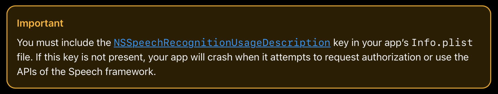
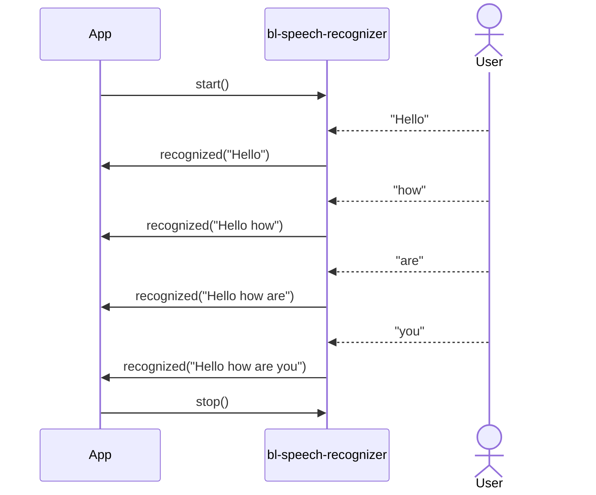
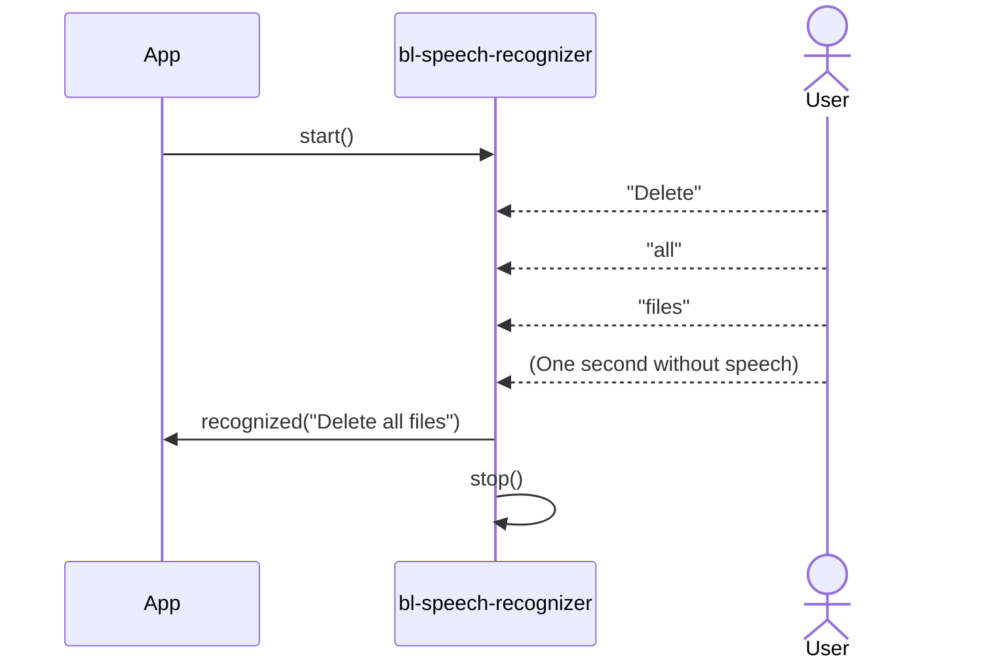

# bl-speech-recognizer

Some implemented use cases for SFSpeechRecognizer. 

## IMPORTANT

From [Apple](https://developer.apple.com/documentation/speech/asking-permission-to-use-speech-recognition):



Add [NSSpeechRecognitionUsageDescription](https://developer.apple.com/documentation/BundleResources/Information-Property-List/NSSpeechRecognitionUsageDescription) to your project _.plist_ file. This key is required if your app uses APIs that send user data to Apple’s speech recognition servers.

## Apple documentation

- Sample code: [Recognizing speech in live audio](https://developer.apple.com/documentation/speech/recognizing-speech-in-live-audio)
- Framework:[Speech](https://developer.apple.com/documentation/speech)
- Article: [Asking Permission to Use Speech Recognition](https://developer.apple.com/documentation/speech/asking-permission-to-use-speech-recognition)

## Sample usage

See [Example app](./examples) to learn how to use the library.

### Continouos speech recognition

```swift
import bl_speech_recognizer

class YourClassViewModel: ObservableObject { 
    // ... your properties
    private var speechRecognizer = ContinuousSpeechRecognizer()
    
    @MainActor
    func startRecording() {
        isRecording = true
    
        speechRecognizer.start(inputType: .microphone, locale: .current) { result in
            switch result {
            case .success(let text):
                self.recognizedText = text
            case .failure(let error):
                self.showError(error.localizedDescription)
            }
        }
    }

    @MainActor
    func stopRecording() {
        isRecording = false
        speechRecognizer.stop()
    }
}
```

You need to stop recognition by calling `stop()` on the recognizer.

### Command speech recognition

```swift
import bl_speech_recognizer

class YourClassViewModel: ObservableObject { 
    // ... your properties

    private var speechRecognizer = CommandSpeechRecognizer()

    @MainActor
    func startRecording() {
        isRecording = true
        speechRecognizer.start(inputType: .microphone, locale: .current) { result in
            switch result {
            case .success(let text):
                self.recognizedText = text
                self.isRecording = false
            case .failure(let error):
                self.showError(error.localizedDescription)
            }
        }
    }
}
```

You don't need to stop recognition, because the **CommandSpeechRecognizer** will do it. But you can add it to allow user to stop it.

## Use cases sequence diagrams

### Continuous recognition



### Command recognition



## StackOverflow useful links

- [How can I specify the format of AVAudioEngine Mic-Input?](https://stackoverflow.com/questions/33484140/how-can-i-specify-the-format-of-avaudioengine-mic-input)
- [ios speech recognition Error Domain=kAFAssistantErrorDomain Code=216 "(null)"](https://stackoverflow.com/questions/44767316/ios-speech-recognition-error-domain-kafassistanterrordomain-code-216-null)
- [Is there a way to use iOS speech recognition in offline mode?](https://stackoverflow.com/questions/42900254/is-there-a-way-to-use-ios-speech-recognition-in-offline-mode)
- [Speech Recognition got an error on iOS](https://stackoverflow.com/questions/39927727/speech-recognition-got-an-error-on-ios)
- [iOS 10.0 Speech Recognition Error kAFAssistantErrorDomain](https://stackoverflow.com/questions/37805891/ios-10-0-speech-recognition-error-kafassistanterrordomain)
- [SFSpeechRecognizer on MacOS not available despite successful authorization](https://stackoverflow.com/questions/59920660/sfspeechrecognizer-on-macos-not-available-despite-successful-authorization/76836073#76836073)
- [SFSpeechRecognizer is not available](https://stackoverflow.com/questions/39741938/sfspeechrecognizer-is-not-available)
- [SFspeechRecognizer recognize speech more than one minutes in ios 15?](https://stackoverflow.com/questions/72306390/sfspeechrecognizer-recognize-speech-more-than-one-minutes-in-ios-15)
- [SFSpeechRecognizer isn't working properly in IOS 13.2](https://stackoverflow.com/questions/58673072/sfspeechrecognizer-isnt-working-properly-in-ios-13-2)
