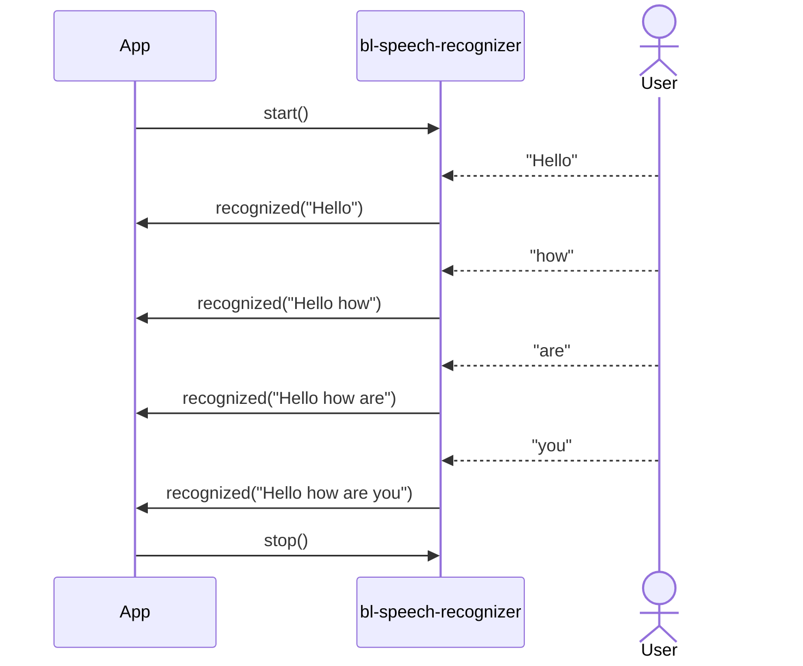
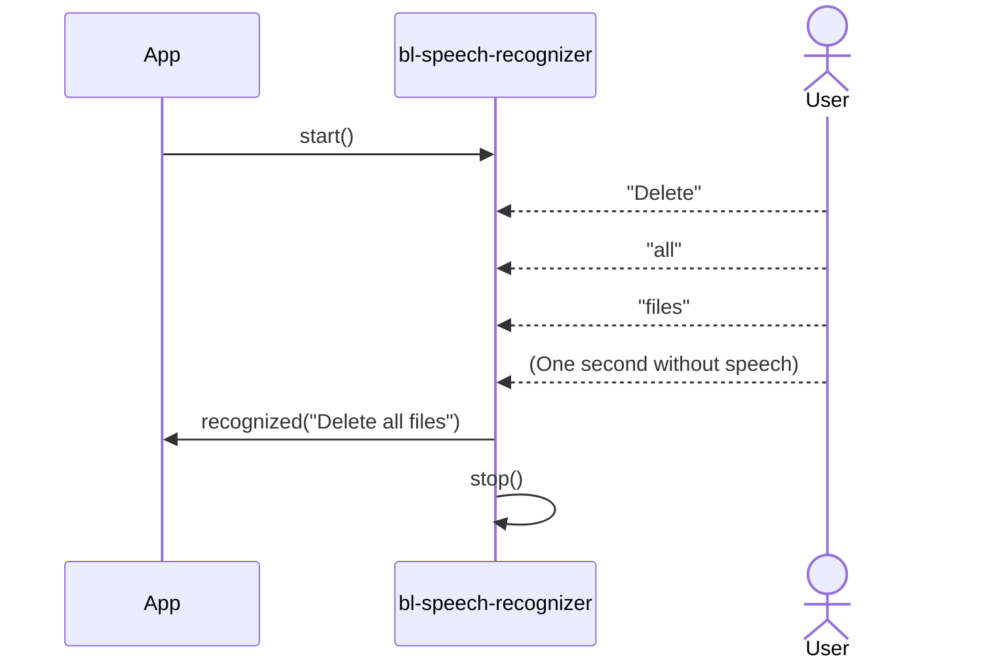

# bl-speech-recognizer

Some implemented use cases for SFSpeechRecognizer. 

## IMPORTANT

From [Apple](https://developer.apple.com/documentation/speech/asking-permission-to-use-speech-recognition):


Add [NSSpeechRecognitionUsageDescription](https://developer.apple.com/documentation/BundleResources/Information-Property-List/NSSpeechRecognitionUsageDescription) to your project _.plist_ file. This key is required if your app uses APIs that send user data to Apple’s speech recognition servers.

## Apple documentation

- Sample code: [Recognizing speech in live audio](https://developer.apple.com/documentation/speech/recognizing-speech-in-live-audio)
- Framework:[Speech](https://developer.apple.com/documentation/speech)
- Article: [Asking Permission to Use Speech Recognition](https://developer.apple.com/documentation/speech/asking-permission-to-use-speech-recognition)

## Sample usage

See [Example app](./examples) to learn how to use the library.

### Continouos speech recognition

```swift
import bl_speech_recognizer

class YourClassViewModel: ObservableObject { 
    // ... your properties
    private var speechRecognizer = ContinuousSpeechRecognizer()
    
    @MainActor
    func startRecording() {
        isRecording = true
    
        speechRecognizer.start(inputType: .microphone, locale: .current) { result in
            switch result {
            case .success(let text):
                self.recognizedText = text
            case .failure(let error):
                self.showError(error.localizedDescription)
            }
        }
    }

    @MainActor
    func stopRecording() {
        isRecording = false
        speechRecognizer.stop()
    }
}
```

You need to stop recognition by calling `stop()` on the recognizer.

### Command speech recognition

```swift
import bl_speech_recognizer

class YourClassViewModel: ObservableObject { 
    // ... your properties

    private var speechRecognizer = CommandSpeechRecognizer()

    @MainActor
    func startRecording() {
        isRecording = true
        speechRecognizer.start(inputType: .microphone, locale: .current) { result in
            switch result {
            case .success(let text):
                self.recognizedText = text
                self.isRecording = false
            case .failure(let error):
                self.showError(error.localizedDescription)
            }
        }
    }
}
```

You don't need to stop recognition, because the **CommandSpeechRecognizer** will do it. But you can add it to allow user to stop it.

## Use cases sequence diagrams

### Continuous recognition



### Command recognition


